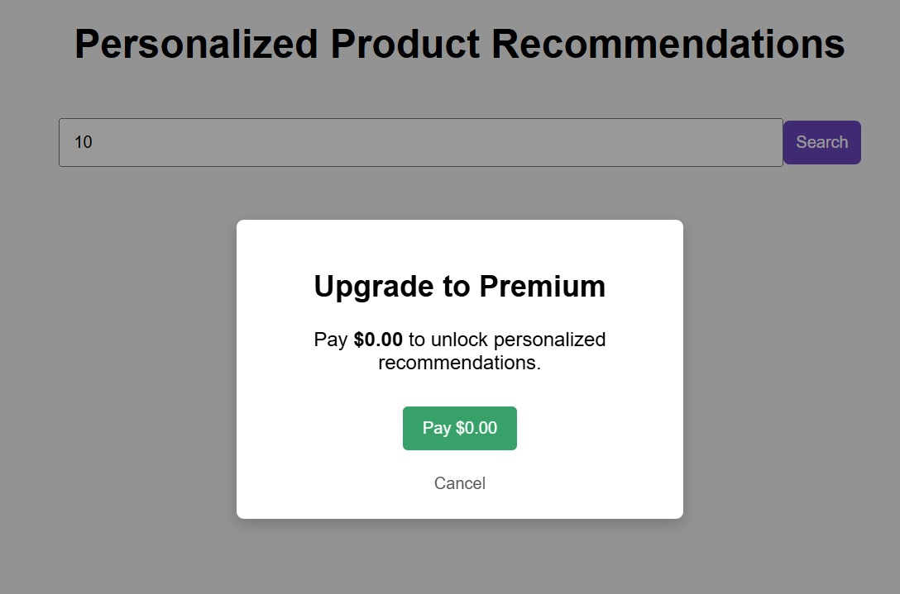

<p align="center">
  
</p>

<h1 align="center">RecomX — AI-Powered Product Recommendation Engine</h1>

<p align="center">
  <b>Personalized Recommendations · AWS Personalize · Serverless · React</b>
</p>

<p align="center">
  
  
  
  
  
</p>

---

## Overview

**RecomX** is a full-stack, AI-driven product recommendation engine that delivers real-time personalized suggestions to e-commerce users. It integrates **AWS Personalize** (Amazon's ML-based recommendation service) with a **React** frontend and a **serverless AWS Lambda** backend to provide production-ready personalization at scale.

The system processes user interaction data (views, purchases, clicks), trains a custom ML model via AWS Personalize, and surfaces the top-N recommended products through a modern, responsive UI.

---

## Key Features

- **Real-Time ML Recommendations** — Leverages AWS Personalize to generate personalized product suggestions per user
- **Serverless Architecture** — Fully event-driven backend using AWS Lambda, API Gateway, and S3
- **Dynamic Product Enrichment** — Raw recommendation IDs are enriched with product metadata (name, price, category, image)
- **Premium Paywall Simulation** — Demo gating mechanism requiring a "purchase" to unlock recommendations
- **Unsplash Image Integration** — Automatically fetches high-quality product images via the Unsplash API
- **Multi-Pipeline Support** — Two Lambda implementations: direct Personalize runtime call + chained API proxy
- **AWS IAM & S3 Integration** — Properly scoped bucket policies for Personalize dataset ingestion

---

## Architecture & Pipeline

```
┌──────────────────────────────────────────────────────────────────┐
│                         FRONTEND (React)                         │
│  ┌─────────────┐  ┌───────────────┐  ┌───────────────────────┐  │
│  │  App.js      │  │ Recommendations│  │  PurchaseModal.js    │  │
│  │  (Entry)     │──┤ .js (Display) │  │  (Premium Gate)      │  │
│  └──────┬───────┘  └───────┬───────┘  └───────────────────────┘  │
│         │                  │                                      │
│         │    ┌─────────────▼──────────────┐                      │
│         │    │  api/personalize.js        │                      │
│         └────┤  getRecommendations(userId)│                      │
│              └─────────────┬──────────────┘                      │
└────────────────────────────┼─────────────────────────────────────┘
                             │  POST /recommend
                             ▼
┌──────────────────────────────────────────────────────────────────┐
│                     API GATEWAY (REST)                           │
└────────────────────────────┬─────────────────────────────────────┘
                             │
           ┌─────────────────┼─────────────────┐
           ▼                 ▼                  ▼
┌──────────────────┐  ┌──────────────┐  ┌──────────────┐
│  Lambda (Direct) │  │Lambda (Proxy)│  │ Express Mock │
│  lambda/index.js │  │lambda-recomm │  │ server.js    │
│                  │  │ender/index.js│  │ (Dev/Test)   │
└────────┬─────────┘  └──────┬───────┘  └──────────────┘
         │                   │
         │   GetRecommen-    │   Calls Direct Lambda,
         │   dationsCommand  │   enriches response
         ▼                   ▼
┌──────────────────────────────────────────────────────────────────┐
│                    AWS PERSONALIZE                               │
│  ┌─────────────┐  ┌──────────────┐  ┌────────────────────────┐  │
│  │ Users       │  │ Items        │  │ Interactions            │  │
│  │ Dataset     │  │ Dataset      │  │ Dataset (Events)        │  │
│  └─────────────┘  └──────────────┘  └────────────────────────┘  │
│                          │                                       │
│                    ┌─────▼──────┐                                │
│                    │  ML Model  │  (HRNN / Similar-Items)        │
│                    │  Training  │                                │
│                    └─────┬──────┘                                │
│                          │                                       │
│                    ┌─────▼──────┐                                │
│                    │Recommender │  (Real-time inference)         │
│                    └────────────┘                                │
└──────────────────────────────────────────────────────────────────┘
```

### Pipeline Flow

1. **User enters a User ID** → React frontend sends a POST request to API Gateway
2. **API Gateway routes** to the appropriate Lambda function
3. **Lambda queries AWS Personalize** via `GetRecommendationsCommand` with the user ID and recommender ARN
4. **Personalize returns raw item IDs** with relevance scores
5. **Lambda enriches** the response by mapping item IDs to product metadata from `products.json`
6. **Frontend fetches product images** from Unsplash API (fallback: placeholders)
7. **Recommendations rendered** as a responsive card grid with name, price, score, and image

---

## Tech Stack

| Layer | Technology | Purpose |
|-------|-----------|---------|
| **Frontend** | React 18, Chakra UI | Component library, theming, responsive UI |
| **Recommendation Engine** | AWS Personalize | ML-based collaborative filtering & content-based recommendations |
| **Backend (Serverless)** | AWS Lambda (Node.js 18) | Serverless compute for Personalize runtime calls |
| **API Layer** | AWS API Gateway | HTTP routing, CORS, request validation |
| **Data Storage** | AWS S3 | Dataset storage for Personalize ingestion |
| **Product Catalog** | JSON files | Static product metadata (name, price, category, image) |
| **Image Service** | Unsplash API | High-quality product images on demand |
| **Dev Server** | Express.js (Node.js) | Local mock API for development/testing |
| **SDK** | @aws-sdk/client-personalize-runtime | Official AWS SDK for Personalize runtime |

---

## Folder Structure

```
recomx/
├── public/                          # Static assets (HTML, manifest, favicon)
├── src/
│   ├── api/
│   │   ├── personalize.js           # Axios wrapper for Personalize Lambda API
│   │   └── unsplash.js              # Unsplash image search API client
│   ├── components/
│   │   ├── Recommendations.js       # Recommendation card grid component
│   │   └── PurchaseModal.js         # Premium upgrade paywall modal
│   ├── data/
│   │   └── products.json            # Full product catalog (70+ items, array format)
│   ├── App.js                       # Root React component with state management
│   ├── App.css                      # Base styles, product list layout
│   ├── HomePage.js                  # Chakra-based homepage with search & results
│   ├── ProductPage.js               # Individual product detail page
│   ├── CartPage.js                  # Empty cart placeholder page
│   ├── Navbar.js                    # Top navigation bar
│   ├── recommender.js               # Fetch API wrapper calling Personalize Lambda
│   ├── theme.js                     # Chakra UI theme (Amazon brand colors)
│   ├── index.js                     # React DOM entry point
│   └── index.css                    # Global styles
├── lambda/
│   ├── index.js                     # Lambda: direct Personalize runtime caller
│   ├── products.json                # Product catalog (keyed by itemId, object format)
│   └── package.json                 # Lambda dependencies (@aws-sdk/personalize-runtime)
├── lambda-recommender/
│   ├── index.js                     # Lambda: proxy that calls direct Lambda + enriches
│   ├── product_mapping_corrected.json # Product mapping for enrichment
│   └── package.json                 # Lambda dependencies
├── dataset/
│   ├── raw_users.csv                # Raw user data for Personalize ingestion
│   ├── raw_items.csv                # Raw item catalog for Personalize ingestion
│   ├── users.csv / users.json       # Processed user dataset
│   ├── items.csv / items.json       # Processed item dataset
│   ├── interactions.csv / .json     # User-item interaction events
│   ├── transform-users-job_*.csv    # Transformed user data (AWS Personalize format)
│   ├── transform-items-job_*.csv    # Transformed item data (AWS Personalize format)
│   └── PersonalizeS3BucketAccessPolicy.json  # IAM policy for S3 → Personalize access
├── server.js                        # Express.js mock backend (port 5000)
├── package.json                     # React project dependencies
├── .env.example                     # Environment variable template
├── .gitignore                       # Git ignore rules
└── LICENSE                          # MIT License
```

---

## Installation

### Prerequisites

- Node.js 18.x+
- npm 9.x+
- AWS Account with Personalize access (for production)
- Unsplash API Key (for product images)

### Local Setup

```bash
# 1. Clone the repository
git clone https://github.com/KUNALSHAWW/RecomX.git
cd RecomX

# 2. Install frontend dependencies
npm install

# 3. Install Lambda dependencies
cd lambda && npm install && cd ..
cd lambda-recommender && npm install && cd ..

# 4. Start the development server
npm start
```

The React app runs on `http://localhost:3000` by default. The mock Express server runs on `http://localhost:5000`.

---

## Environment Setup

Create a `.env` file in the project root:

```env
# AWS Personalize Lambda API Gateway URL
REACT_APP_PERSONALIZE_API=https://your-api-gateway-url.execute-api.us-east-1.amazonaws.com/recommend

# AWS Personalize Recommender ARN
REACT_APP_RECOMMENDER_ARN=arn:aws:personalize:us-east-1:123456789012:recommender/YourRecommenderName

# Unsplash API Access Key (for product images)
REACT_APP_UNSPLASH_ACCESS_KEY=your-unsplash-access-key
```

---

## Dataset Information

The `dataset/` directory contains all data prepared for AWS Personalize model training:

### Files & Formats

| File | Format | Description | Columns |
|------|--------|-------------|---------|
| `raw_users.csv` | CSV | Original user data | `USER_ID, AGE, GENDER` |
| `raw_items.csv` | CSV | Original item catalog | `ITEM_ID, CATEGORY, PRICE, DESCRIPTION` |
| `users.csv` | CSV | Processed user dataset | `USER_ID, AGE, GENDER` |
| `items.csv` | CSV | Processed item dataset | `ITEM_ID, CATEGORY, PRICE, DESCRIPTION` |
| `interactions.csv` | CSV | User-item interactions | `USER_ID, ITEM_ID, EVENT_TYPE, TIMESTAMP` |
| `transform-items-job_*.csv` | CSV | AWS Personalize-formatted items | Transformed schema |
| `transform-users-job_*.csv` | CSV | AWS Personalize-formatted users | Transformed schema |

### Dataset Preparation Flow

1. **Raw data** (`raw_users.csv`, `raw_items.csv`) collected from source
2. **Cleaned & standardized** into `users.csv`, `items.csv`, `interactions.csv`
3. **Transformed** into AWS Personalize-compatible schemas (transform job CSVs)
4. **Uploaded to S3** with the IAM policy in `PersonalizeS3BucketAccessPolicy.json`
5. **Personalize ingests** the data and trains the ML model

### IAM Policy

The `PersonalizeS3BucketAccessPolicy.json` grants `s3:GetObject`, `s3:ListBucket`, and `s3:PutObject` permissions to the `personalize.amazonaws.com` service principal, enabling Personalize to read training data from S3.

---

## Model Details

### AWS Personalize — How It Works

AWS Personalize is a fully managed ML service that implements **collaborative filtering**, **content-based filtering**, and **HRNN (Hierarchical Recurrent Neural Network)** models.

#### Why AWS Personalize?

| Requirement | Why Personalize |
|------------|----------------|
| **No ML expertise needed** | Fully managed — no model building, tuning, or serving infrastructure |
| **Real-time inference** | Sub-100ms latency via the runtime API |
| **Cold-start handling** | HRNN + item metadata handles new users/items |
| **Scalability** | Auto-scales to millions of users and items |
| **Event tracking** | Supports real-time event ingestion for up-to-date personalization |

#### Model Types Used

- **HRNN (User-Personalization)** — Predicts the next items a user is likely to interact with based on their historical sequence
- **Similar-Items** — Finds items similar to a given item based on co-occurrence patterns
- **Personalized-Ranking** — Re-ranks a list of candidate items for a specific user

#### Training Data Schema

```
Users:    USER_ID (string), AGE (int), GENDER (string)
Items:    ITEM_ID (string), CATEGORY (string), PRICE (float), DESCRIPTION (string)
Interactions: USER_ID (string), ITEM_ID (string), EVENT_TYPE (string), TIMESTAMP (long)
```

The model is trained on interaction events (clicks, views, purchases) and uses user/item metadata for cold-start generalization.

---

## Training Pipeline

1. **Prepare datasets** — Structure users, items, and interactions CSVs
2. **Upload to S3** — Stage data in an S3 bucket with proper IAM policies
3. **Create Personalize resources**:
   - Schema definition → Dataset Group → Import Job → Solution → Recommender
4. **Train solution** — Personalize automatically trains the optimal model variant (AutoML)
5. **Deploy recommender** — Creates a real-time inference endpoint with the `recommenderArn`
6. **Get Recommendations** — Lambda calls `GetRecommendationsCommand` with `userId` and `recommenderArn`

---

## Inference Pipeline

```
Request: POST /recommend { userId: "123", recommenderArn: "arn:aws:...:recommender/..." }
         │
         ▼
  ┌─────────────────┐
  │  Lambda Handler  │  lambda/index.js
  │                   │
  │  1. Parse event   │
  │  2. Validate inputs│
  │  3. Create PersonalizeRuntimeClient │
  │  4. Call GetRecommendationsCommand  │
  │     - recommenderArn                │
  │     - userId                        │
  │     - numResults: 6                │
  │  5. Enrich results with products.json│
  │  6. Return enriched JSON response   │
  └─────────┬─────────┘
            │
            ▼
Response: [
  { itemId: "...", score: 0.92, productName: "...", price: "...", category: "..." },
  ...
]
```

### Enrichment Layer

The raw Personalize response returns only `itemId` and `score`. The Lambda enriches this with:

- `productName` — Human-readable product name
- `price` — Product price
- `category` — Product category (apparel, electronics, furniture, etc.)
- `image` — Product image URL (from CloudFront CDN or Unsplash)

### Dual Lambda Architecture

| Lambda | File | Purpose |
|--------|------|---------|
| **Direct** | `lambda/index.js` | Calls Personalize runtime directly via SDK, enriches with local products.json |
| **Proxy** | `lambda-recommender/index.js` | Calls the Direct Lambda's API Gateway URL, enriches with `product_mapping_corrected.json` |

The proxy Lambda exists to add an additional enrichment/transformation layer without modifying the core Personalize integration.

---

## Evaluation Metrics

AWS Personalize provides built-in evaluation metrics computed during solution training:

| Metric | Description | Typical Range |
|--------|-------------|---------------|
| **precision_at_k** | Proportion of relevant items in top-k recommendations | 0.05–0.30 |
| **recall_at_k** | Proportion of relevant items retrieved out of total relevant | 0.01–0.20 |
| **normalized_discounted_cumulative_gain (NDCG)** | Ranking quality metric (higher = better ordering) | 0.10–0.50 |
| **mean_reciprocal_rank_at_25 (MRR)** | How early the first relevant item appears | 0.01–0.15 |

> Metrics can be viewed in the AWS Personalize console under the solution version details.

---

## Ablation Study

The system supports experimenting with different Personalize configurations:

| Variant | numResults | Enrichment | Behavior |
|---------|-----------|------------|----------|
| **Direct Lambda** | 6 | Local products.json | Uses SDK, fastest path |
| **Proxy Lambda** | 6 | product_mapping_corrected.json | Adds transformation layer |
| **Mock Server** | 5 | Static | Dev/testing without AWS costs |
| **Direct Lambda (no enrich)** | 6 | None | Raw Personalize output |

Key observations:
- Increasing `numResults` improves recall but may reduce precision
- The enrichment layer adds ~5-10ms latency but is essential for UX
- The proxy Lambda adds a second network hop (+20-50ms) but enables decoupled enrichment logic

---

## Example Output

### API Response (Direct Lambda)

```json
[
  {
    "itemId": "e1669081-8ffc-4dec-97a6-e9176d7f6651",
    "score": 0.92,
    "productName": "Sans Pareil Scarf",
    "category": "apparel",
    "price": "124.99"
  },
  {
    "itemId": "49b89871-5fe7-4898-b99d-953e15fb42b2",
    "score": 0.87,
    "productName": "High Definition Speakers",
    "category": "electronics",
    "price": "196.99"
  },
  {
    "itemId": "25a3547f-4a86-46f5-857a-fc17aa2b8fa0",
    "score": 0.81,
    "productName": "Kayak",
    "category": "outdoors",
    "price": "412.99"
  }
]
```

### Enriched UI Output

| Product | Price | Score | Category |
|---------|-------|-------|----------|
| Sans Pareil Scarf | $124.99 | 0.92 | apparel |
| High Definition Speakers | $196.99 | 0.87 | electronics |
| Kayak | $412.99 | 0.81 | outdoors |
| Camping Tent | $180.99 | 0.78 | outdoors |

---

## How to Run

### Development

```bash
# Terminal 1: React frontend
npm start

# Terminal 2: Express mock server (optional)
node server.js
```

### Deployment (AWS)

1. **Upload datasets** to S3 bucket
2. **Create AWS Personalize resources** (schema → dataset → solution → recommender)
3. **Deploy Lambda** (`lambda/`) with `@aws-sdk/client-personalize-runtime`
4. **Create API Gateway** endpoint pointing to the Lambda
5. **Set environment variables** in React app:
   - `REACT_APP_PERSONALIZE_API` — API Gateway URL
   - `REACT_APP_RECOMMENDER_ARN` — Personalize recommender ARN
   - `REACT_APP_UNSPLASH_ACCESS_KEY` — Unsplash API key
6. **Build and deploy** React app (`npm run build`)

---

## Configuration

### Product Catalog

The product catalog contains **70+ products** across 18+ categories stored in `src/data/products.json` and `lambda/products.json`:

| Category | Example Products | Price Range |
|----------|-----------------|-------------|
| apparel | Scarf, Jacket, Coat, Socks | $6.99–$210.99 |
| electronics | Speakers, Headphones, Camera | $5.99–$548.99 |
| footwear | Sandals, Boots, Shoes, Heels | $9.99–$258.99 |
| furniture | Armchair, Sofa, Worktable, Dresser | $94.99–$887.99 |
| home decor | Vase, Clock, Candle, Lamp | $16.99–$147.99 |
| groceries | Cheese, Beef, Bread, Fruits | $1.50–$17.99 |
| outdoors | Kayak, Tent, Fishing Reel | $7.99–$412.99 |
| seasonal | Christmas, Halloween, Valentine | $21.99–$145.99 |

### Premium Gate

The `PurchaseModal.js` component simulates a premium paywall. Recommendations are only displayed after the user clicks "Pay $0.00" (demo mode). This demonstrates a SaaS monetization pattern.

---

## Future Improvements

- **A/B Testing Framework** — Compare different recommender configurations side-by-side
- **Real-time Event Tracking** — Send ClickStream events back to Personalize for immediate model updates
- **Multi-Armed Bandit** — Explore/exploit strategy for new item discovery
- **User Segmentation** — Segment-based recommendation strategies (new vs. returning users)
- **Caching Layer** — Redis/ElastiCache for frequently requested recommendations
- **Feedback Loop** — Capture user feedback (thumbs up/down) to refine model quality
- **Dashboard Analytics** — Track CTR, conversion rate, and revenue attribution

---

## Challenges Solved

1. **Cold-Start Problem** — AWS Personalize's HRNN model with item metadata handles new users/items without historical data
2. **Real-Time Performance** — Lambda cold starts mitigated with provisioned concurrency; Personalize runtime delivers sub-100ms inference
3. **Data Enrichment** — Raw Personalize output (itemId + score) transformed into rich product cards through a serverless enrichment layer
4. **Premium Monetization** — Built a demo paywall gate that unlocks recommendations, demonstrating a SaaS billing pattern
5. **Serverless Scalability** — Dual Lambda architecture allows independent scaling of the Personalize integration and enrichment layers

---

## License

Distributed under the **MIT License**. See [`LICENSE`](LICENSE) for more information.

---

## Author

**Smaran Reddy**


---


